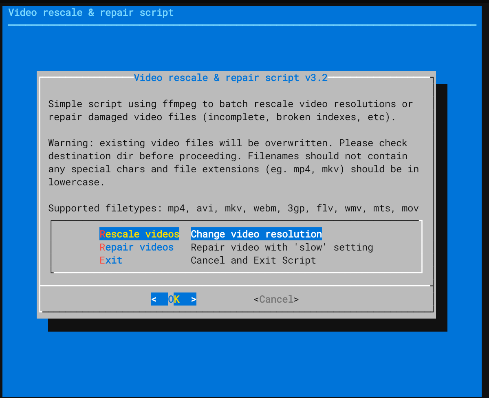
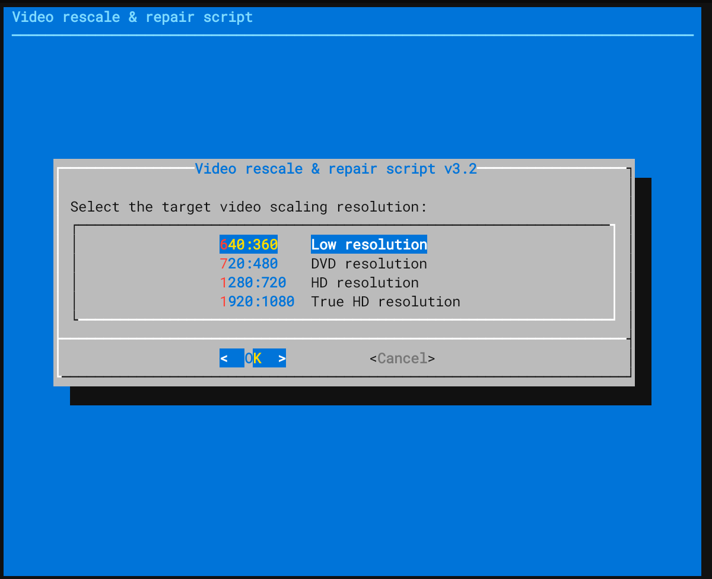
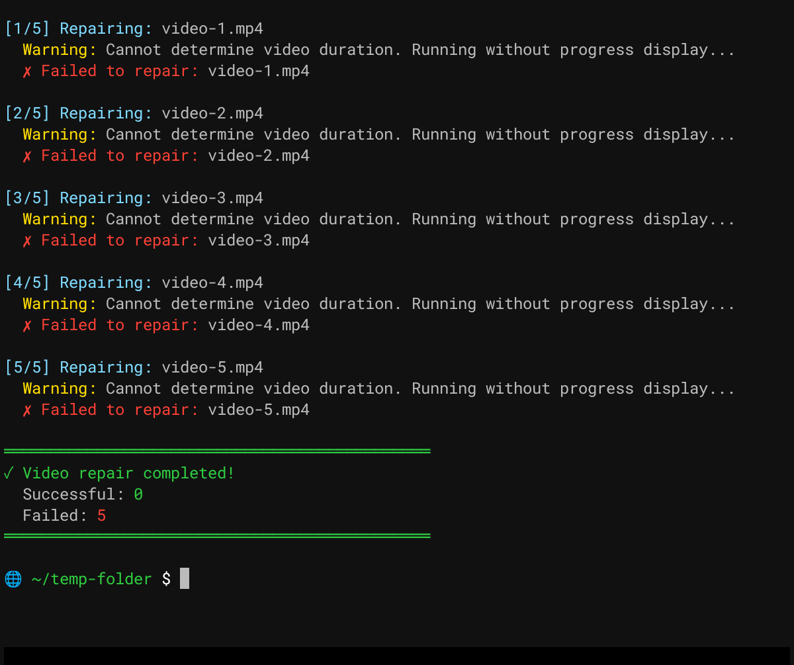

# Video Rescale and Repair Script

Version 3.2

Changelog:-

Rewrite to include positional parameter support, ffmpeg installed check, supported file extension check, show successful result, percentage & ETA display, added support for more filetypes, color tweaks, ncurses-style menus with dialog.

# PURPOSE

A simple bash script to convert videos to target resolution or repair damaged video files using ffmpeg. A quick and easy way to handle videos without messing about with long ffmpeg flags or running bloated (and shady) conversion software. No fluff, just straightforward conversion. Feel free to inspect the script and make your own changes.

Minimal system resource usage and is well suited to running in a headless environment (ie. no GUI).

# SYSTEM REQUIREMENTS

As long as your system can run ffmpeg, the system requirements are sufficient. The more CPU and RAM you have, the faster the video conversion will be.

Video filetypes supported are:

mp4, avi, mkv, webm, 3gp, flv, wmv, mts, and mov.

This scripts was designed to run on linux debian clones (eg. ubuntu, mint, debian etc). Other linux derivatives, such as arch, are unsupported.

# INSTALLATION

Execute script with the first parameter to the source videos directory and the second parameter to the destination videos directory. Script can be run as unpriviledged user:

./video-rescale-repair-script-vX.sh (source-dir) (target-dir)

# SCREENSHOTS

   

# DISCLAIMER
Please review this script carefully. NEVER run
a script blindly without understanding what it could do. Don't trust me. Google around to find out more. Please research, research, research.

# LEGAL
Please note that by downloading and running this script you acknowledge that I am not responsible or liable for any damages or losses arising from your use or inability to use the script and or software used under this script. You are solely responsible for your use of this script. If you harm someone or get into a dispute with a 3rd party, you consent to me waiving any involvement.
